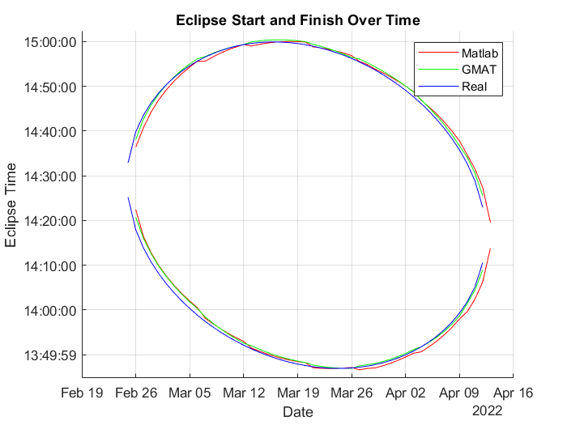

# satellite-eclipse-prediction
 Predict when eclipse happening during a course of the season and then compare it to real data and other sources
## Penyusun:
1. Hilmi Nuruzzaman
## Pembimbing:
1. Davi Evananda, S.T.

# Cara menjalankan program
Program ditulis dalam bahasa MATLAB, pastikan MATLAB sudah terinstall.
## Petunjuk penggunaan
### 1. Buka program main.m kemudian jalankan.
Program akan mengeluarkan output pada file dataMatlab.txt.
Output dari program dataMatlab.txt merupakan prediksi yang dibuat oleh program.
### 2. Buka program main2.m kemudian jalankan.
Program akan membandingkan data pada dataMatlab.txt dengan hasil perhitungan GMAT dan hasil asli.
Output program dapat dilihat pada EclipStartFin.png

